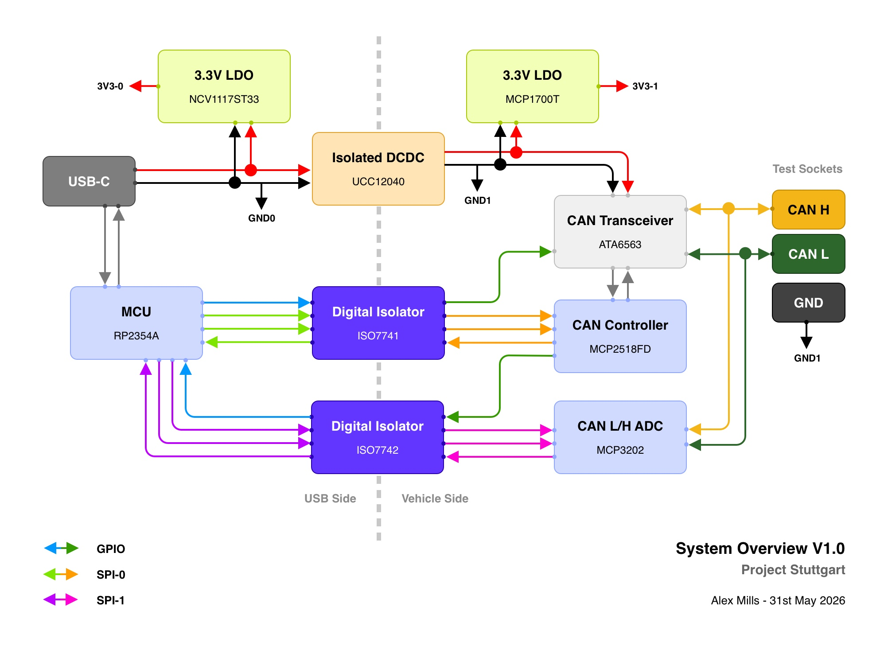

# Project Stuttgart

*Last Updated: 31st May 2026*

> Named after the founding location of Bosch in 1886, where a team in 1983 started development of the Connected Area Network.

The goal for this research project is to explore the benefits of having a clearer look at the CAN bus during vehicle diagnostics, instead of relying solely on multimeter or oscilloscope measurements.
## Overview

The tool connects to the CAN bus in a **read only** capacity, receiving messages and monitoring bus health while simultaneously measuring the voltage on the High and Low signal lines to identify physical layer faults. The CAN controller's transmit line is still connected for some future experiments with J1939.

A small web app connects to the tool using WebUSB (in Chrome/Edge) to control and monitor its data output in real time. 

*The design and component selection **will not** take production into consideration, this is purely a research project. I get easily sidetracked worrying about how to make n-amount instead of just making one first...*
## Isolation & Safety

The microcontroller and USB are completely isolated from the components connected to the vehicle electronics through the CAN bus, protecting the laptop and user from any potential voltage differences between chassis ground and mains earth. This isolation also eliminates ground loops, improves signal integrity, and provides a clean ground reference for the vehicle measurements.

## Target Vehicle / Networks

Primary targets are heavy duty vehicles which use a combination of J1939 and J2284 networks. The initial goal of the tool is not to decode these messages but to verify the bus is healthy and that frames are being transmitted without errors or corruption.

Both standards build on ISO 11898 *Road Vehicles - Controller Area Network (CAN),* with their own additions and modifications.

**J1939** spans both **physical** and **application** layers, defining its own physical layer specifications as well as how the messages are structured and what they mean. Unlike J2284, the use of CAN 2.0B 29-bit extended identifiers is mandated.

**J2284** defines the **physical** layer and portions of the **data link** layer, with OBD-II, UDS and proprietary **application** layers running on top. Both standards reference ISO 11898-2 for the high speed CAN physical layer, meaning the bus voltage levels are identical and the same transceiver hardware can be used across all target networks.
## Status

The current state of the project as follows:

- [x] Project Scope
- [x] Architecture & Protocol Design
- [ ] Component Selection (Active)
- [ ] Schematic Design
- [ ] PCB Design
- [ ] Enclosure Design
- [ ] Firmware Implementation
- [ ] App Implementation
- [ ] Testing

## Main Components

| Component            | Part No                        | JLC No    | Status | Models |
| -------------------- | ------------------------------ | --------- | ------ | ------ |
| MCU                  | Raspberry Pi RP2354A           | C41378174 | ✅      | ✅      |
| CAN FD Controller    | Microchip MCP2518FD            | C621395   | ✅      | ✅      |
| CAN FD Transceiver   | Microchip ATA6563              | C5127614  | ✅      | ✅      |
| Voltage ADC          | MCP3202-CI/SN                  | C56997    | ✅      | ✅      |
| Isolated DC-DC       | TI UCC12040DVER                | C5216535  | ✅      | ✅      |
| Digital Isolator 1   | TI ISO7741 (3F/1R)             | C913840   | ✅      | ✅      |
| Digital Isolator 2   | TI ISO7742 (2F/2R)             | C2868557  | ✅      | ✅      |
| 3.3V LDO (CAN Side)  | Microchip MCP1700T-3302E/TT    | C39051    | ✅      | ✅      |
| 3.3V LDO (MCU Side)  | OnSemi NCV1117ST33T3G          | C114733   | ✅      | ✅      |
| MCP2518FD Oscillator | SCTF SX2M20.000B10F20TNN       | C7431315  | ✅      | ❓      |
| 12MHz Crystal        | Abracon ABM8-272-T3            | C20625731 | ✅      | ❓      |
| SMPS Inductor        | Abracon AOTA-B201610S3R3-101-T | C42411119 | ✅      | ❓      |
| TVS Diodes           | SMBJ5.0A x2                    |           | ❓      | ❓      |
| Schottky Clamp       | BAT54 x2                       |           | ❓      | ❓      |
| BOOTSEL Button       | Wurth 434133025816             | C5504987  | ✅      | ✅      |
| USB-C Connector      | G-Switch GT-USB-7047C          | C963218   | ✅      | ❓      |
| SWD Header           | JST SM03B-SRSS-TB              | C160403   | ✅      | ✅      |
| CANH Socket          | Cliff FCR7350Y (Yellow)        | Digikey   | ✅      | ✅      |
| CANL Socket          | Cliff FCR7350G (Green)         | Digikey   | ✅      | ✅      |
| GND Socket           | Cliff FCR7350B (Black)         | Digikey   | ✅      | ✅      |

## System Architecture

Below is the high level architecture of the system, including the USB/Vehicle isolation and main active components.

### Vehicle / USB Isolation

The SPI and GPIO circuits are isolated using Texas Instruments ISO774X series digital isolators ([Datasheet](https://www.ti.com/lit/ds/symlink/iso7742.pdf)). Both have a SPI throughput of 100Mbps, providing more than enough headroom for the CAN Controller and ADC.

The 5V supply from the USB-C connector is isolated using a Texas Instruments UCC12040 DC-DC Module ([Datasheet](https://www.ti.com/lit/ds/symlink/ucc12040.pdf)), providing 3kV protection, low EMI and 500mW of output power.

Between these 3 components, there is no physical connection between the vehicle and the USB connector.

### Vehicle Interface

The CAN communication to the vehicle is achieved using a Microchip MCP2518FD CAN-FD ([Datasheet](https://ww1.microchip.com/downloads/aemDocuments/documents/OTH/ProductDocuments/DataSheets/External-CAN-FD-Controller-with-SPI-Interface-DS20006027B.pdf)) controller paired with the recommended ATA6563 Microchip transceiver ([Datasheet](https://ww1.microchip.com/downloads/aemDocuments/documents/APID/ProductDocuments/DataSheets/ATA6562.3-Data-Sheet-20005790E.pdf)). The CAN Signals and vehicle reference ground are provided through CLIFF 4mm 1kV "banana" sockets usually found on multimeters, so my normal test leads and accessories can be used.