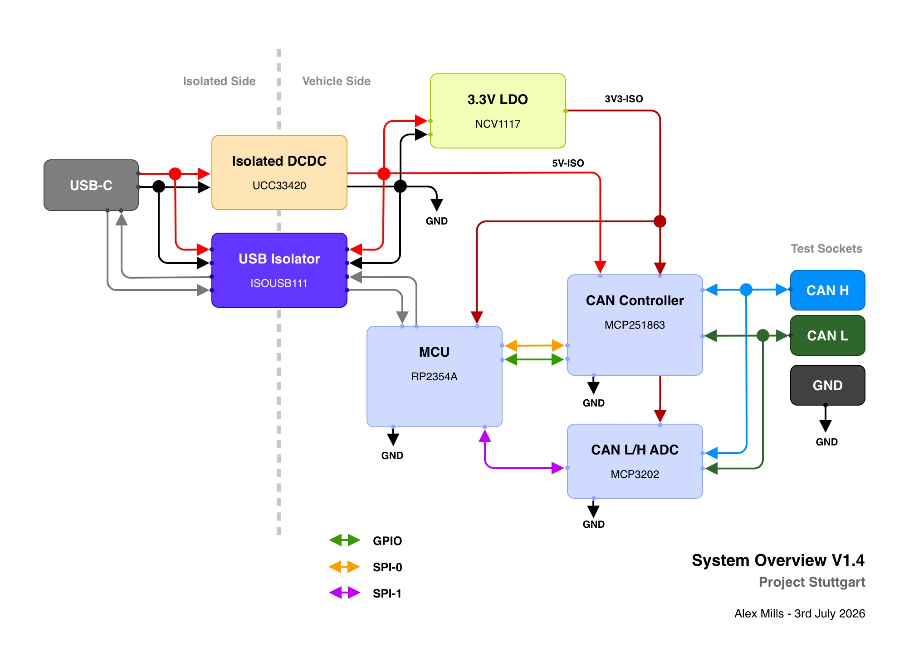

# Project Stuttgart

*Last Updated: 3rd July 2026*

> Named after the founding location of Bosch in 1886, where a team in 1983 started development of the Connected Area Network.

The goal for this research project is to explore the benefits of having a clearer look at the CAN bus during vehicle diagnostics, instead of relying solely on multimeter or oscilloscope measurements.
## Overview

The tool connects to the CAN bus in a **read only** capacity, receiving messages and monitoring bus health while simultaneously measuring the voltage on the High and Low signal lines to identify physical layer faults. The CAN controller's transmit line is still connected for some future experiments with J1939.

A small web app connects to the tool using WebSerial (in Chrome/Edge) to control and monitor its data output in real time. 

*The design and component selection **will not** take production into consideration, this is purely a research project. I get easily sidetracked worrying about how to make n-amount instead of just making one first...*
## Isolation & Safety

The microcontroller and USB are completely isolated from the components connected to the vehicle electronics through the CAN bus, protecting the laptop and user from any potential voltage differences between chassis ground and mains earth. This isolation also eliminates ground loops, improves signal integrity, and provides a clean ground reference for the vehicle measurements.

## Target Vehicle / Networks

Primary targets are heavy duty vehicles which use a combination of J1939 and J2284 networks. The initial goal of the tool is not to decode these messages but to verify the bus is healthy and that frames are being transmitted without errors or corruption.

Both standards build on ISO 11898 *Road Vehicles - Controller Area Network (CAN),* with their own additions and modifications.

**J1939** spans both **physical** and **application** layers, defining its own physical layer specifications as well as how the messages are structured and what they mean. Unlike J2284, the use of CAN 2.0B 29-bit extended identifiers is mandated.

**J2284** defines the **physical** layer and portions of the **data link** layer, with OBD-II, UDS and proprietary **application** layers running on top. Both standards reference ISO 11898-2 for the high speed CAN physical layer, meaning the bus voltage levels are identical and the same transceiver hardware can be used across all target networks.

## Status

The current state of the project as follows:

- [x] Project Scope
- [x] Architecture & Protocol Design
- [x] Component Selection
- [ ] Schematic Design (Active)
- [ ] PCB Design
- [ ] Enclosure Design
- [ ] Firmware Implementation
- [ ] App Implementation
- [ ] Testing

## Main Components

| Component              | Part No                       | JLC No    | Status | Models |
| ---------------------- | ----------------------------- | --------- | ------ | ------ |
| MCU                    | Raspberry Pi RP2354A          | C41378174 | ✅      | 📦     |
| CAN FD Controller      | Microchip MCP251863           | C20295647 | ✅      | ✅      |
| Voltage ADC            | MCP3202-CI/SN                 | C56997    | ✅      | ✅      |
| Isolated DC-DC         | TI UCC33420                   | C46461551 | ✅      | ✅      |
| Isolated USB           | TI ISOUSB111DWR               | C5216549  | ✅      | ✅      |
| 3.3V LDO               | OnSemi NCV1117ST33T3G         | C114733   | ✅      | ✅      |
| MCP2518FD Crystal      | Murata XRCGE20M000F3A1AR0     | C6758395  | ✅      | 📦     |
| 12MHz Crystal          | Abracon ABM8-272-T3           | C20625731 | ✅      | ✅      |
| SMPS Inductor          | Abracon AOTA-B201610S3R3-101T | C42411119 | ✅      | ✅      |
| Transceiver TVS Diodes | Littelfuse SMBJ5.0A           | C83333    | ✅      | 📦     |
| ADC Zener Diodes       | Onsemi SZMM5Z3V3T1G           | C464127   | ✅      | 📦     |
| BOOTSEL Button         | Wurth 434133025816            | C5504987  | ✅      | ✅      |
| USB-C Connector        | GCT USB4105-GF-060            | C3025063  | ✅      | 📦     |
| SWD Header             | JST SM03B-SRSS-TB             | C160403   | ✅      | ✅      |
| CANH Socket            | Cliff FCR7350Y (Blue)         | Digikey   | ✅      | ✅      |
| CANL Socket            | Cliff FCR7350G (Green)        | Digikey   | ✅      | ✅      |
| GND Socket             | Cliff FCR7350B (Black)        | Digikey   | ✅      | ✅      |

## System Architecture

Below is the high level architecture of the system, including the USB/Vehicle isolation and main active components.



### Vehicle / USB Isolation

The VBUS from the USB-C connector is isolated using a Texas Instruments UCC33420 DC-DC Converter, providing 1.5W / 300mA to the 5V Rail.

The USB data is isolated using a Texas Instruments ISOUSB111 USB Isolator, which sits between the USB-C Connector and RP2354. Combining this IC with the DC-DC converter means the main components on the PCB sit on the "vehicle side", completely isolated from the USB port and connected computer.

### Vehicle Interface

The CAN communication to the vehicle is achieved using a Microchip MCP251863, integrating the MCP2518-FD Controller and ATA6563 Transceiver into a single package ([Datasheet]([https://ww1.microchip.com/downloads/aemDocuments/documents/OTH/ProductDocuments/DataSheets/External-CAN-FD-Controller-with-SPI-Interface-DS20006027B.pdf](https://ww1.microchip.com/downloads/aemDocuments/documents/APID/ProductDocuments/DataSheets/MCP251863-External-CAN-FD-Controller-with-Integrated-Transceiver-DS20006624.pdf))). The CAN Signals and vehicle reference ground are provided through CLIFF 4mm 1kV "banana" sockets usually found on multimeters, so my normal test leads and accessories can be used.

## Power Requirements

### 3V3 Rail

| Component | Typical  | Max      | Notes             |
| --------- | -------- | -------- | ----------------- |
| RP2354    | 16mA     | 20mA     | USB Comms Test    |
| MCP2518FD | 15mA     | 20mA     | 40MHz SYSCLK      |
| ATA6563   | 0.25mA   | 0.5mA    | VIO 3V3 Logic Pin |
| MCP3202   | 0.4mA    | 0.55mA   | VSS = 5.0V        |
| **TOTAL** | **32mA** | **41mA** |                   |

The RP2354 draws around 16mA with constant data being written to the USB port as per the hardware data sheet. 

### LDO Thermal

The recommended LDO for the RP2354 is the NCP1117 family of which we are using the automotive version, NCV1117

**OnSemi NCP1117**
- Output: 1.0A @ 3.3V
- Maximum Junction Temperature Range: -55c to 150c
- Junction-to-ambient thermal resistance: 160c/W (SOT-223 worst case)

At maximum load of 41mA the LDO dissipates 70mW as heat, causing a junction rise above ambient of only 11c. With a realistic max enclosure temperature of 55c, a junction temperature of 66c is well within limits.

### Isolated 5V Rail

| Condition            | ATA6563    | ISOUSB111 | 5V Direct Total |
| -------------------- | ---------- | --------- | --------------- |
| Startup / No Monitor | 0mA (STBY) | ~12-15mA  | **~12-15mA**    |
| Passive (recessive)  | ~2-5mA     | ~12-15mA  | **~14-20mA**    |
| TX Burst (max dom)   | 70mA       | ~15mA     | **~85mA**       |
| **CANL/H Short**     | **85mA**   | **~15mA** | **~100mA**      |

### Total 5V DC-DC Load

3V3 rail load reflected through the LDO at ~1:1

| Condition             | 3V3 LDO   | 5V Direct  | DC-DC Total | Power @ 5V |
| --------------------- | --------- | ---------- | ----------- | ---------- |
| Startup / No Monitor  | ~32mA     | ~12mA      | ~44mA       | ~220mW     |
| Passive Monitor (max) | ~41mA     | ~17mA      | ~58mA       | ~290mW     |
| TX Burst (max dom)    | ~41mA     | ~85mA      | ~126mA      | ~630mW     |
| **Short Fault (max)** | **~32mA** | **~100mA** | **~141mA**  | **~705mW** |

### DC-DC Converter Thermal

**TI UCC33420**
- 1.5W / 300mA @ 5.0V
- Recommended Junction Temperature Range: -40 to 125c 
- Junction-to-ambient thermal resistance: 59.7c/W
- Dissipation at full load: 1050mW
- Efficiency: ~59%

At the worst case scenario, we draw 141mA or 705mW from the converter which at roughly 59% efficiency requires an input load of 1195mW or 240mA, of which 490mW is dissipated as heat equalling a rise of 29c above ambient. With the realistic max enclosure temperature of 55c, the junction temperature of 84c is well within limits.

For 99% of the time the load is much smaller at around 290mW, requiring 492mW of which 202mW is lost as heat, causing a junction rise above ambient of only 12c. 

### USB Requirements

| Condition             | DC-DC Load     | ISOUSB111 | VBUS Total |
| --------------------- | -------------- | --------- | ---------- |
| Startup / No Monitor  | 74mA / 372mW   | ~12-15mA  | ~89mA      |
| Passive Monitor (max) | 98mA / 492mW   | ~12-15mA  | ~113mA     |
| TX Burst (max dom)    | 213mA / 1068mW | 15mA      | ~228mA     |
| Short Fault (max)     | 240mA / 1195W  | 15mA      | ~256mA     |

With the transceiver in standby mode until needed, our system power requirements at boot are under the 100mA USB initial limit, which can be upped to 400-500mA with negotiations by the RP2354.

## Bus ADC Measurements

The voltage divider for each bus is `R1 = 10kΩ` and `R2 = 47kΩ` so the ratio is calculated as:

```
Vout = Vin x (R2 / (R1 + R2))
Vout = Vin x (47,000 / (10,000 + 47,000))
Vout = Vin x (47,000 / 57,000)
Vout = Vin x 0.8246
```

Below are the estimated values for the ADC measurements at various bus voltages using the above divider with a protection zener diode, clamping at ~3.3V, keeping the ADC within safe limits (3.6V Max). 

| Bus Voltage | ADC Voltage | RAW ADC Value | Notes                         |
| ----------- | ----------- | ------------- | ----------------------------- |
| 0           | 0           | 0             | Bus Dead / Off                |
| 1.5         | 1.237       | 1535          | CAN L Dominant                |
| 2.5         | 2.062       | 2559          | Recessive Idle                |
| 3.5         | 2.886       | 3583          | CAN H Dominant                |
| **3.9**     | **3.223**   | **4000**      | **Clean bus fault threshold** |
| 4.0         | 3.300       | 4095          | Zener Activates               |
| Over 4.0    | 3.300       | 4095          | Clamped - Fault Condition     |

